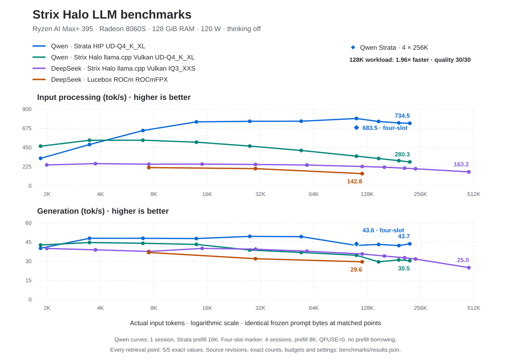

# Benchmarks

Measured on the same BOSGAME M5, Ryzen AI Max+ 395 / Radeon 8060S, 128 GiB RAM, and 120 W package policy. Requests disable thinking. Matched points use identical frozen prompt bytes and require five byte-exact retrieval values.

## Qwen3.8-Flash-Next UD-Q4_K_XL

**Winning setup for Qwen: Strata HIP UD-Q4_K_XL.** The comparison baseline is Strix Halo llama.cpp Vulkan UD-Q4_K_XL.

| Configuration | Exact input | Input processing | Generation | Request time | Quality |
|---|---:|---:|---:|---:|---:|
| Strix Halo llama.cpp Vulkan UD-Q4_K_XL | 114,089 | 347.96 tok/s | 34.69 tok/s | 329.35 s | 30/30 |
| Strata HIP UD-Q4_K_XL · single session | 114,089 | 790.40 tok/s | 42.40 tok/s | 145.79 s | 30/30 |
| **Strata HIP UD-Q4_K_XL · four-slot** | **114,089** | **683.50 tok/s** | **43.60 tok/s** | **168.31 s** | **30/30** |

The four-slot recipe reduces request time by **48.9% (1.96× faster)** versus Vulkan. The single-session profile is **2.26× faster** at this matched workload.

### Qwen context scaling

| Workload | Exact Qwen input | Vulkan input tok/s | Strata input tok/s | Vulkan generation tok/s | Strata generation tok/s | Vulkan seconds | Strata seconds |
|---|---:|---:|---:|---:|---:|---:|---:|
| 2K | 1,881 | 465.25 | 322.40 | 42.76 | 40.20 | 5.45 | 7.35 |
| 4K | 3,552 | 534.63 | 484.40 | 44.69 | 48.00 | 7.99 | 8.60 |
| 8K | 7,118 | 535.41 | 648.90 | 44.09 | 48.00 | 14.66 | 12.24 |
| 16K | 14,249 | 512.34 | 750.90 | 43.21 | 47.80 | 29.20 | 20.25 |
| 32K | 28,512 | 466.38 | 757.50 | 38.80 | 49.50 | 62.45 | 38.69 |
| 64K | 55,639 | 415.00 | 758.50 | 36.91 | 49.30 | 135.70 | 74.41 |
| 128K | 114,089 | 347.96 | 790.40 | 34.69 | 42.40 | 329.35 | 145.79 |
| 160K | 152,124 | 320.77 | 755.20 | 29.57 | 43.20 | 475.96 | 202.84 |
| 208K | 197,765 | 294.96 | 738.30 | 31.08 | 42.30 | 672.41 | 269.32 |
| 240K | 228,192 | 280.26 | 734.50 | 30.48 | 43.70 | 816.18 | 312.09 |

The curves use one session with 131,072-token allocation through the 128K workload and 262,144 thereafter. Strata uses a 16K prefill cap, native UD-Q4_K_XL expert/PLE tensors, BF16-compatible dense tensors, int8 KV, and MTP speculation. Vulkan uses q8_0 K/V, a 2,048-token batch, 256-token microbatch, and shared Q8_0 MTP draft with maximum draft length 2. The separate four-slot result uses four 262,144-token slots, an 8K prefill cap, QFUSE=0, and no prefill borrowing.

### Four-slot capacity

Four simultaneous independent 228,244-token prompts passed exact retrieval, session isolation, and continued two-turn conversations. Four slots decoded simultaneously. Minimum effective non-CMA available memory was 14,921,348 KiB (14.23 GiB). Four slots are qualified; higher counts have no published qualification.

## DeepSeek-V4-Flash-0731

**Winning setup for DeepSeek: Strix Halo llama.cpp Vulkan IQ3_XXS.** The comparison baseline is Lucebox ROCm ROCmFPX.

| Stack | Exact input | Input processing | Generation | Quality |
|---|---:|---:|---:|---:|
| Strix Halo llama.cpp Vulkan IQ3_XXS | 122,879 | 226.82 tok/s | 35.73 tok/s | 30/30 |
| Lucebox ROCm ROCmFPX | 122,879 | 142.82 tok/s | 29.60 tok/s | 29/30 |

### DeepSeek context scaling

| Stack | Allocation | Exact input | Input processing | Generation |
|---|---:|---:|---:|---:|
| Strix Halo llama.cpp Vulkan IQ3_XXS | 131,072 | 2,040 | 245.23 tok/s | 40.04 tok/s |
| Strix Halo llama.cpp Vulkan IQ3_XXS | 131,072 | 3,840 | 260.12 tok/s | 38.98 tok/s |
| Strix Halo llama.cpp Vulkan IQ3_XXS | 131,072 | 7,680 | 254.07 tok/s | 37.70 tok/s |
| Strix Halo llama.cpp Vulkan IQ3_XXS | 131,072 | 15,359 | 254.94 tok/s | 40.09 tok/s |
| Strix Halo llama.cpp Vulkan IQ3_XXS | 131,072 | 30,720 | 250.59 tok/s | 39.48 tok/s |
| Strix Halo llama.cpp Vulkan IQ3_XXS | 131,072 | 59,933 | 244.19 tok/s | 37.90 tok/s |
| Strix Halo llama.cpp Vulkan IQ3_XXS | 131,072 | 122,879 | 226.82 tok/s | 35.73 tok/s |
| Strix Halo llama.cpp Vulkan IQ3_XXS | 262,144 | 163,840 | 218.56 tok/s | 34.12 tok/s |
| Strix Halo llama.cpp Vulkan IQ3_XXS | 262,144 | 212,992 | 206.65 tok/s | 32.77 tok/s |
| Strix Halo llama.cpp Vulkan IQ3_XXS | 262,144 | 245,760 | 200.21 tok/s | 31.77 tok/s |
| Strix Halo llama.cpp Vulkan IQ3_XXS | 524,288 | 491,520 | 163.23 tok/s | 25.02 tok/s |
| Lucebox ROCm ROCmFPX | 131,072 | 7,680 | 213.91 tok/s | 36.90 tok/s |
| Lucebox ROCm ROCmFPX | 131,072 | 30,720 | 201.68 tok/s | 32.00 tok/s |
| Lucebox ROCm ROCmFPX | 131,072 | 122,879 | 142.82 tok/s | 29.60 tok/s |

## Protocol and quality

Cold retrieval uses deterministic filler with five values near 2%, 20%, 50%, 80%, and 98% depth, temperature 0, top-k 1, top-p 1, and one cold request per point. The output cap is 80 tokens for Qwen and 256 for DeepSeek. Throughput is reported by each engine; request time is input-processing time plus generation time. Exact prompt SHA-256 values, output counts, and Qwen completion-count/time rates are in [results.json](../benchmarks/results.json). Different model tokenizers produce different token counts for the same prompt bytes.

Quality uses all ten coding, ten GSM8K-style, and ten MATH-style cases from the [pinned Lucebox harness](https://github.com/Luce-Org/lucebox/tree/90f85fa401c6a3c61d9e4d0e2da7fc48a5e8915e/harness). Coding answers execute against their tests; numeric scores use reviewed final answers. The corrected `math_08` reference is `20/3`; interval whitespace is normalized.

| Stack / model | Coding | GSM8K-style | MATH-style | Total |
|---|---:|---:|---:|---:|
| Strata HIP UD-Q4_K_XL / Qwen | 10/10 | 10/10 | 10/10 | 30/30 |
| Strix Halo llama.cpp Vulkan UD-Q4_K_XL / Qwen | 10/10 | 10/10 | 10/10 | 30/30 |
| Strix Halo llama.cpp Vulkan IQ3_XXS / DeepSeek | 10/10 | 10/10 | 10/10 | 30/30 |
| Lucebox ROCm ROCmFPX / DeepSeek | 10/10 | 10/10 | 9/10 | 29/30 |

Quality completion caps are 512 for coding, 1,024 for GSM8K-style, and 2,048 for MATH-style. Strata's `math_10` uses 4,096 tokens; it scores 29/30 with the original caps. Lucebox's `math_10` returns `998` against reference `997`.

The four-slot Strata quality checkpoint uses a 16K prefill cap and prompts of at most 141 tokens; those prompts fit wholly within the four-slot 8K cap. Its short-prompt batch test passes exact token parity. Interleave scenarios complete, while one continued-conversation case differs in strict token parity. Answer quality and four independent long conversations pass.

## Reproduction

[results.json](../benchmarks/results.json) contains source/model identities, prompt hashes, request parameters, exact token counts, all measured points, and qualification aggregates. Ansible manifests pin artifacts and build inputs. The published Strata recipe preserves the qualified serving flags and tensor hashes with portable installation paths; the reference executable hash identifies the measured build, and each portable build is sealed locally.

Qwen uses kernel `7.0.0-31-generic`; DeepSeek uses `7.0.0-29-generic`. Strata and Vulkan run with CPU boost off and GPU DPM auto. Lucebox runs with CPU boost on and GPU DPM high. The demand fan controller samples once per second, returns to firmware-auto after 300 idle seconds, and uses maximum cooling on failure. Its measured activation latency is 1.520 seconds; prefill/decode/end-to-end ratios against fixed fans are 1.0000/1.0018/1.0018.
